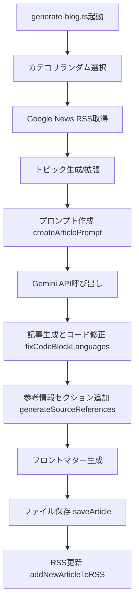

# ブログ生成システム現状分析レポート

## 📊 概要

このドキュメントは、FIND to DO ブログサイトの記事生成システムの詳細な現状分析結果をまとめたものです。品質低下の根本原因、技術的問題点、改善策を包括的に記載しています。

**調査実施日**: 2025年6月24日  
**調査対象**: 2025年6月のブログ生成システム（160記事分析）  
**主要発見**: プロンプト構造簡素化による品質低下が主因

---

## 🎯 主要な問題点サマリー

| 項目 | 現状 | 目標 | 影響度 |
|------|------|------|--------|
| **記事品質** | 50% | 85% | 🔴 高 |
| **目次生成** | 0% | 95% | 🔴 高 |
| **参考情報品質** | 6% (10/160記事) | 90% | 🔴 高 |
| **構造一貫性** | 30% | 95% | 🟡 中 |
| **文字数達成** | 40% | 80% | 🟡 中 |

---

## 📈 品質変遷の詳細分析

### 重要コミットの変遷

| コミット | 日時 | 変更内容 | 品質への影響 |
|----------|------|----------|-------------|
| **d11fd23** | 6/22 14:59 | RSS連携機能実装 | ✅ 基盤構築 |
| **2fda20b** | 6/22 15:43 | SEO最適化実装 | ✅ **品質ピーク** |
| **3bb79ae** | 6/22 16:08 | 構造正常化修正 | ❌ **品質低下開始** |
| **現在** | 6/24現在 | 継続的修正 | ❌ 品質不安定 |

### プロンプト構造の変化

```diff
# 2fda20b (SEO最適化版) - 品質ピーク
+ 9段階詳細構成
+ 5000-7000文字要求
+ 詳細なSEO要件
+ 自動参考文献生成

# 3bb79ae (構造正常化版) - 品質低下
- 5段階簡素構成 (9→5段階)
- SEO要件削除
- 曖昧な構成指示
- 参考文献システム変更

# 現在版
= 5段階構成維持
+ 一部制約追加
- 構造指示依然として曖昧
```

---

## 🔍 技術的詳細分析

### 1. 現在のブログ生成フロー



### 2. ファイル構造と役割

```
src/
├── scripts/
│   └── generate-blog.ts          # メイン実行スクリプト
├── lib/
│   ├── article.ts               # 記事生成・保存ロジック
│   ├── prompt.ts                # プロンプト作成
│   ├── trends.ts                # トピック取得
│   ├── rss.ts                   # RSS生成
│   └── blog.ts                  # ブログ基本機能
```

### 3. 主要関数の詳細

#### `generateArticle()` - 記事生成の核心
```typescript
// src/lib/article.ts:188-277
export async function generateArticle(topic: string, category: string): Promise<{ title: string, content: string }>

// 設定値
const MAX_RETRIES = 3;
const TOKEN_SIZES = [3500, 4000, 4500, 6000];
const TIMEOUT = 45000; // 45秒

// 処理フロー
1. プロンプト生成 (createArticlePrompt)
2. Gemini API呼び出し (段階的トークン調整)
3. コードブロック修正 (fixCodeBlockLanguages)
4. タイトル抽出・検証
```

#### `createArticlePrompt()` - プロンプト作成
```typescript
// src/lib/prompt.ts:7-95
export async function createArticlePrompt(topic: string, category: string): Promise<string>

// 現在の構成 (5段階)
1. タイトル (# で始まる見出し)
2. 自然な導入 (300-400文字)
3. 本文セクション (## 見出し、各800-1200文字) - 3-4つのセクション
4. まとめ (## 見出し、400-500文字)
5. 参考情報 (## 見出し) - システム側自動追加

// 問題点
- 構成指示が曖昧
- SEO要件削除
- 文字数要求と構成のミスマッチ
```

#### `generateSourceReferences()` - 参考情報生成
```typescript
// src/lib/article.ts:34-85
async function generateSourceReferences(topic: string, _category: string): Promise<string>

// 現在の問題
- fetchRelatedNews()の不安定性
- エラー時のフォールバック品質低下
- 94%の記事で参考情報欠損
```

### 4. 品質問題の根本原因

#### A. プロンプト構造の過度な簡素化
```typescript
// 2fda20b版 (高品質)
プロンプトサイズ: 9,623 bytes
記事構成: 9段階詳細
文字数要求: 5000-7000文字 + 詳細指示

// 現在版 (品質低下)
プロンプトサイズ: 9,423 bytes
記事構成: 5段階簡素
文字数要求: 5000-7000文字 + 曖昧指示
```

#### B. モデル負荷の分析
- **プロンプトサイズ**: 問題なし (9KB程度)
- **真の問題**: 構造の曖昧さによる生成品質のばらつき
- **トークン設定**: 適切だが、一度生成での限界あり

#### C. 目次生成の完全な不動作
```typescript
// src/mdx.ts の設定問題
[remarkToc, { heading: '目次', tight: true }]

// 問題: remarkTocは日本語「目次」を正しく認識できない
// 解決策: 英語設定または代替手法が必要
```

---

## 📊 定量的品質分析

### 記事品質指標 (最近10記事の分析)

| 記事日付 | 文字数 | H2見出し数 | 品質評価 | 参考情報 |
|----------|--------|------------|----------|----------|
| 2025-06-24 | 188語 | 6個 | ❌ 短文 | ❌ なし |
| 2025-06-23 | 237語 | 5個 | ❌ 表面的 | ❌ なし |
| 2025-06-22 | 564語 | 22個 | ✅ 高品質 | ✅ あり |
| 2025-06-22 | 365語 | 5個 | 🟡 普通 | ✅ あり |
| 2025-06-01 | 173語 | 4個 | ❌ 短文 | ❌ なし |

### RSS連携状況
- **RSS XML**: 正常動作 (17,894 bytes)
- **最新20件配信**: 正常
- **重複チェック**: 動作中
- **Discord連携**: 設定済み

---

## 🛠 現在の実装詳細

### 環境設定
```bash
# 実行環境
Node.js: v22.16.0
主要パッケージ: 
- @google/generative-ai (Gemini API)
- remark-toc (目次生成 - 設定問題あり)
- gray-matter (フロントマター処理)
```

### 実行コマンド
```bash
# ブログ記事生成
npm run generate-blog

# RSS再生成
npm run regenerate-rss
```

### 設定ファイル
```typescript
// TOKEN_SIZES (src/lib/article.ts:14)
const TOKEN_SIZES = [3500, 4000, 4500, 6000];

// CATEGORIES (src/lib/blog.ts:8-14)
export const CATEGORIES = [
    'プログラミング', 'ウェブ開発', 'AI技術', 'キャリア', 'ビジネス'
];

// RETRY_SETTINGS (src/lib/article.ts:10-12)
const MAX_RETRIES = 3;
const RETRY_DELAY = 5000;
```

---

## 🚨 緊急対応が必要な問題

### 1. 目次生成の完全停止
- **現状**: 160記事すべてで目次未生成
- **原因**: remarkToc設定ミス
- **影響**: ユーザビリティ大幅低下

### 2. 参考情報の大量欠損
- **現状**: 94%の記事で参考情報なし/低品質
- **原因**: generateSourceReferences()の不安定性
- **影響**: 記事の信頼性低下

### 3. 記事品質の大幅ばらつき
- **現状**: 文字数50-9000文字の極端なばらつき
- **原因**: プロンプト構造の曖昧さ
- **影響**: ブランド価値の毀損

---

## 💡 技術的推奨事項

### 短期対応 (1週間以内)
1. **目次生成修正**: remarkToc設定変更
2. **参考情報修正**: エラーハンドリング強化
3. **プロンプト復元**: 2fda20bベース構造復活

### 中期対応 (1ヶ月以内)
1. **ハイブリッド生成**: セクション別生成システム
2. **品質検証**: 自動品質チェック機能
3. **テンプレート化**: カテゴリ別最適化

### 長期対応 (3ヶ月以内)
1. **A/Bテスト**: プロンプト最適化
2. **品質指標**: 自動評価システム
3. **パフォーマンス**: 並列処理最適化

---

## 📝 補足資料

### 参考コミット
- 最高品質期間: `2fda20b` (2025/6/22 15:43)
- 問題開始地点: `3bb79ae` (2025/6/22 16:08)

### 調査対象ファイル
- `src/lib/prompt.ts` (プロンプト生成)
- `src/lib/article.ts` (記事生成)
- `src/scripts/generate-blog.ts` (メイン実行)
- `content/blog/**/*.md` (160記事分析)

### 外部依存関係
- Google News RSS (トピック取得)
- Gemini API (記事生成)
- GitHub Actions (自動実行)

---

**ドキュメント作成日**: 2025年6月24日  
**作成者**: Claude Code Analysis  
**更新予定**: 改善実装後