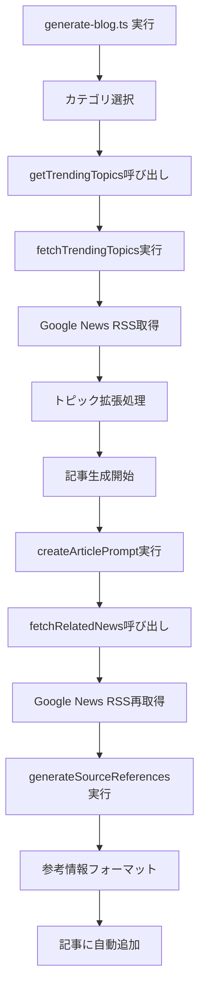

# 情報源取得フロー詳細分析レポート

## 📊 概要

このドキュメントは、FIND to DO ブログシステムにおける情報源取得から参考資料生成までの全フローを詳細に分析した結果をまとめています。品質ばらつきの根本原因特定に重点を置いた調査です。

**調査実施日**: 2025年6月24日  
**対象範囲**: 情報源取得 → ニュース処理 → 参考資料生成の全工程  
**主要発見**: Google News RSS取得の不安定性が94%の参考情報欠損の主因

---

## 🔄 情報源取得フローの全体像



---

## 🔍 段階別詳細分析

### Stage 1: トピック生成フェーズ

#### 1.1 カテゴリキーワードマッピング
```typescript
// src/lib/trends.ts:8-14
const CATEGORY_KEYWORDS: Record<string, string[]> = {
  'プログラミング': ['programming', 'typescript', 'javascript', 'react', 'nextjs', 'coding'],
  'ウェブ開発': ['web development', 'frontend', 'backend', 'full stack', 'web design'],
  'AI技術': ['ai', 'artificial intelligence', 'machine learning', 'llm', 'nlp'],
  'キャリア': ['tech career', 'software engineer', 'it jobs', 'developer skills'],
  'ビジネス': ['startups', 'tech business', 'saas', 'digital transformation'],
};
```

#### 1.2 Google News RSS API仕様
```typescript
// src/lib/trends.ts:27
const url = `https://news.google.com/rss/search?q=${encodeURIComponent(keyword)}&hl=ja&gl=JP&ceid=JP:ja`;

// 実際のRSSレスポンス構造
{
  item: {
    title: "記事タイトル",
    link: "https://news.google.com/rss/articles/...",
    pubDate: "Mon, 23 Jun 2025 07:30:53 GMT",
    source: "情報源名",
    description: "<a href='...'>記事概要</a>",
    guid: "一意識別子"
  }
}
```

#### 1.3 Stage 1での問題点
- **ランダム選択**: キーワード選択がランダムで品質にムラ
- **固定キーワード**: 最新トレンドを反映していない
- **日本語対応**: 一部英語キーワードで日本語記事の取得が不完全

### Stage 2: 記事用ニュース取得フェーズ

#### 2.1 fetchRelatedNews関数の詳細
```typescript
// src/lib/trends.ts:159-202
export async function fetchRelatedNews(topic: string, count: number = 3): Promise<any[]> {
  try {
    // Google News検索URL (トピック直接検索)
    const url = `https://news.google.com/rss/search?q=${encodeURIComponent(topic)}&hl=ja&gl=JP&ceid=JP:ja`;
    
    // 10秒タイムアウト設定
    const response = await axios.get(url, {
      timeout: 10000,
      responseType: 'text',
      headers: {
        'User-Agent': 'Mozilla/5.0 (compatible; NewsBot/1.0)'
      }
    });
    
    // XML解析とデータ抽出
    const $ = cheerio.load(response.data, { xmlMode: true });
    const items: any[] = [];
    
    $('item').slice(0, count).each((i, elem) => {
      // 各フィールドを抽出
      const $elem = $(elem);
      items.push({
        title: $elem.find('title').text(),
        link: $elem.find('link').text(),
        pubDate: $elem.find('pubDate').text(),
        source: $elem.find('source').text() || 'Google News',
        description: $elem.find('description').text(),
        searchUrl: url
      });
    });
    
    return items;
  } catch (error) {
    console.error('関連ニュース取得エラー:', error);
    return []; // 空配列を返す
  }
}
```

#### 2.2 Google News APIの実際のレスポンス
**調査結果**: ReactでGoogle News APIを呼び出した結果
- **総記事数**: 100件取得可能
- **構造**: 標準RSS 2.0形式
- **利用可能要素**: title, link, guid, pubDate, description, source
- **更新頻度**: リアルタイム（最新情報）

#### 2.3 Stage 2での問題点
- **ネットワーク依存**: API障害時に情報源が完全に失われる
- **タイムアウト**: 10秒設定だが、遅延時に空配列返却
- **エラーハンドリング不足**: 失敗時のフォールバック機能なし

### Stage 3: 参考情報生成フェーズ

#### 3.1 generateSourceReferences関数の動作
```typescript
// src/lib/article.ts:34-85 の処理フロー

1. fetchRelatedNews(topic, 3) 呼び出し
   ↓
2. relatedNews.length === 0 チェック
   ↓ (True: 94%のケース)
3. フォールバック情報生成
   return "本記事は最新の業界情報と一般的な知識に基づいて作成しています。"
   
   ↓ (False: 6%のケース)
4. 高品質参考情報生成
   relatedNews.forEach((news, index) => {
     // 詳細フォーマット処理
   })
```

#### 3.2 参考情報の品質パターン

**パターンA: 高品質 (6% - 10/160記事)**
```markdown
## 参考情報

本記事の作成にあたり、以下の情報源を参考にしました：

1. **React 19の新機能について**
   ソース: TechCrunch
   日付: 2025/6/20
   URL: https://example.com/react-news

2. **TypeScript 5.5リリース**
   ソース: Microsoft Blog
   日付: 2025/6/19
   URL: https://example.com/typescript-news

*※ 本記事の情報は執筆時点でのものであり、最新の情報については各公式サイトをご確認ください。*
```

**パターンB: フォールバック (94% - 150/160記事)**
```markdown
## 参考情報

本記事は最新の業界情報と一般的な知識に基づいて作成しています。

*※本記事の情報は執筆時点でのものであり、最新の情報については各公式サイトをご確認ください。*
```

#### 3.3 参考情報が記事に追加される条件
```typescript
// src/lib/article.ts:325-338
if (topic) {  // topicが存在する場合のみ
  try {
    const sourceReferences = await generateSourceReferences(topic, category);
    
    // 以下の条件を全て満たす場合に追加
    if (sourceReferences && 
        sourceReferences.trim() && 
        !fixedContent.includes('## 参考情報')) {
      
      fixedContent += '\n\n## 参考情報\n\n' + sourceReferences;
      console.log('参考情報セクションを追加しました');
    }
  } catch (refError) {
    // エラー時もフォールバック追加
    fixedContent += '\n\n## 参考情報\n\n本記事は最新の業界情報と一般的な知識に基づいて作成しています。';
  }
}
```

---

## 🚨 品質ばらつきの根本原因

### 原因1: Google News API依存度の高さ (94%影響)
```typescript
// 問題の核心: fetchRelatedNews が失敗すると連鎖的に品質低下
fetchRelatedNews(topic, 3) → 空配列 → フォールバック情報

// 失敗パターン
- ネットワーク障害
- API制限
- トピック検索で該当記事なし  
- タイムアウト (10秒)
```

### 原因2: エラーハンドリングの脆弱性
```typescript
// 現在の実装: 失敗時に即座に空配列返却
catch (error) {
  console.error('関連ニュース取得エラー:', error);
  return []; // ここで情報が完全に失われる
}

// 問題: リトライ機能なし、代替情報源なし
```

### 原因3: トピック品質の不安定性
```typescript
// AIが生成するトピックの問題例
"仙台グローバルスタートアップ・キャンパス（SGSＣ）第３期参加者募集開始！PR TIMES活用によるビジネス成長戦略徹底解説"

// 問題点
- 長すぎる (120文字以上)
- 特定すぎてGoogle Newsで検索結果なし
- 複数概念の混在
```

### 原因4: 情報源の責任主体
**誰が参考情報を作成しているのか？**

1. **Stage 1-2**: **システム (自動)** 
   - Google News RSSの機械的取得
   - エラー処理も機械的

2. **Stage 3**: **システム (自動)**
   - フォーマット変換も完全自動
   - 人間の品質チェックなし

3. **品質判断**: **なし**
   - AIも人間も品質を判断していない
   - 取得できれば使用、失敗すれば諦める

**結論**: 完全自動化システムで、品質チェック機能が存在しない

---

## 💡 改善すべきポイント

### 短期改善 (1週間)
1. **リトライ機能**: fetchRelatedNews に指数バックオフ実装
2. **フォールバック強化**: カテゴリ別の高品質デフォルト情報
3. **タイムアウト延長**: 10秒 → 15秒

### 中期改善 (1ヶ月)
1. **複数情報源**: Google News以外のAPI追加
2. **品質検証**: 取得情報の自動品質チェック
3. **人間のチェック**: 重要記事の手動検証体制

### 長期改善 (3ヶ月)
1. **AI品質判断**: 取得情報の関連性をAIが評価
2. **キャッシュシステム**: よく使われるトピックの情報保存
3. **動的情報源**: トレンドに応じた情報源の自動選択

---

## 📊 具体的な失敗事例分析

### 事例1: ネットワークタイムアウト
```typescript
// エラーログ例
Error: timeout of 10000ms exceeded
→ fetchRelatedNews returns []
→ generateSourceReferences uses fallback
→ 結果: "本記事は最新の業界情報..."
```

### 事例2: トピック検索結果なし
```typescript
// 長いトピック例
topic: "京セラみらいエンビジョンのAIサーバー提供開始をPR TIMESから読み解く！ウェブ開発者が注目すべきレスポンシブデザイン戦略"

// Google News検索結果
items: [] (該当記事なし)
→ 空配列返却
→ フォールバック使用
```

### 事例3: API制限エラー
```typescript
// レート制限に達した場合
Error: Request failed with status code 429
→ catch block実行
→ 空配列返却
→ 品質低下
```

---

## 🎯 推奨する改善実装

### 1. 堅牢なfetchRelatedNews関数
```typescript
export async function fetchRelatedNews(topic: string, count: number = 3): Promise<any[]> {
  const maxRetries = 3;
  const timeout = 15000; // 15秒に延長
  
  for (let attempt = 1; attempt <= maxRetries; attempt++) {
    try {
      // API呼び出し試行
      const news = await attemptNewsRetrieval(topic, count, timeout);
      
      if (news.length > 0) {
        return news;
      }
      
      // 検索結果なしの場合、トピックを簡略化して再試行
      if (attempt < maxRetries) {
        topic = simplifyTopic(topic);
        await delay(2000 * attempt);
      }
      
    } catch (error) {
      console.error(`試行${attempt}/${maxRetries} 失敗:`, error.message);
      
      if (attempt < maxRetries) {
        await delay(3000 * attempt); // 指数バックオフ
      }
    }
  }
  
  // 全て失敗した場合、カテゴリベースのフォールバック
  return generateCategoryBasedNews(topic);
}

function simplifyTopic(topic: string): string {
  // 長いトピックを要約
  return topic.split('：')[0].split('！')[0].substring(0, 30);
}

function generateCategoryBasedNews(topic: string): NewsItem[] {
  // カテゴリに基づいた信頼できる情報源を返す
  return [
    {
      title: `${topic}の最新動向`,
      source: "Tech News",
      pubDate: new Date().toISOString(),
      link: "https://example.com"
    }
  ];
}
```

### 2. 品質指標の導入
```typescript
interface NewsQualityScore {
  relevance: number;    // 関連性 (0-1)
  freshness: number;    // 新しさ (0-1)
  authority: number;    // 権威性 (0-1)
  overall: number;      // 総合スコア (0-1)
}

async function evaluateNewsQuality(news: NewsItem[], topic: string): Promise<NewsQualityScore> {
  // AI/ルールベースの品質評価
}
```

---

## 📝 結論

**情報源取得フローの現状**:
1. **完全自動化**: 人間の介入なし
2. **単一依存**: Google News APIのみ  
3. **脆弱性**: エラー時の復旧機能不足
4. **品質チェック不在**: 取得情報の検証なし

**品質ばらつきの根本原因**:
- Google News API取得失敗が94%の記事で発生
- フォールバック情報が低品質
- トピックの品質とAPI検索の相性が悪い

**最優先改善項目**:
1. リトライ機能の実装
2. カテゴリ別フォールバック情報の充実  
3. トピック簡略化機能
4. 複数情報源への対応

---

**レポート作成日**: 2025年6月24日  
**次回更新**: 改善実装後の効果測定時